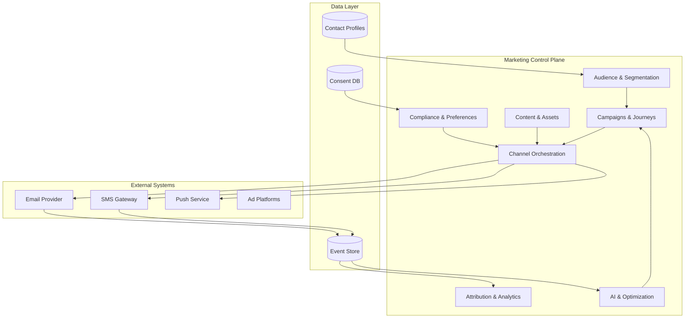

# Functional Architecture - Marketing Automation Module

## Module Overview

---

## 1. Audience & Segmentation Engine

### Purpose
Build dynamic, real-time audience segments based on behavioral data, demographics, and predictive scores.

### Core Capabilities
- **Dynamic Segmentation**: Auto-refresh based on conditions (e.g., "Active in last 30 days").
- **Static Snapshots**: Freeze audience for specific campaigns.
- **Nested Logic**: AND/OR/NOT conditions with unlimited depth.
- **Predictive Segments**: "Likely to churn", "High engagement potential".
- **Exclusion Lists**: Suppression, unsubscribes, bounces.

### Input
- Contact/Account profiles
- Event history (clicks, opens, purchases)
- CRM fields (industry, ARR, lifecycle stage)
- AI scores (engagement, churn risk)

### Output
- Segment IDs
- Audience counts (total, reachable)
- Audience preview (sample contacts)

### Dependencies
- **Contacts Service**: Profile data
- **Events Service**: Behavioral data
- **AI Service**: Predictive scores

### Integration Points
| Module | Integration | Data Flow |
|--------|-------------|-----------|
| CRM Contacts | Real-time profile sync | Bidirectional |
| Events | Behavior tracking | Events → Segments |
| Campaigns | Audience targeting | Segments → Campaigns |
| Analytics | Segment performance | Segments → Dashboards |

### Key Tables
- `marketing_segments`
- `segment_conditions`
- `segment_memberships` (materialized view for performance)
- `segment_snapshots` (point-in-time captures)

---

## 2. Campaigns & Journeys

### Purpose
Orchestrate multi-step, personalized journeys across channels.

### Core Capabilities
- **Journey Builder**: Visual flow designer (drag-drop nodes).
- **Campaign Types**:
  - One-time broadcasts
  - Recurring campaigns (daily digest, weekly newsletter)
  - Event-triggered journeys (welcome, abandoned cart)
- **Versioning**: V1, V2, V3 with rollback capability.
- **A/B Testing**: Split traffic, measure winners.
- **Simulation Mode**: Test journey logic before launch.

### Node Types
| Node | Function | Example |
|------|----------|---------|
| **Trigger** | Entry point | "Contact created", "Form submitted" |
| **Wait** | Delay | 24 hours, 3 days, "until 9am" |
| **Condition** | Branch logic | If opened email → path A, else → path B |
| **Action** | Do something | Send email, add tag, create task |
| **Exit** | End journey | "Journey complete" |
| **Split** | A/B test | 50% variant A, 50% variant B |

### Input
- Segment IDs (audience)
- Journey definition (nodes, edges)
- Content templates
- Scheduling params (send time, frequency cap)

### Output
- Journey executions (user states)
- Performance metrics (entered, completed, exited)
- Event logs (every step tracked)

### Dependencies
- **Segmentation**: Audience targeting
- **Content**: Email/SMS templates
- **Channel Orchestration**: Delivery execution
- **Events**: Track user progress

### Integration Points
| Module | Integration | Data Flow |
|--------|-------------|-----------|
| Segmentation | Audience selection | Segments → Journeys |
| Content | Template rendering | Content → Messages |
| Orchestration | Message delivery | Journeys → Channels |
| Analytics | Performance tracking | Journey stats → Dashboards |

### Key Tables
- `campaigns`
- `journeys` (DAG structure stored as JSONB)
- `journey_versions`
- `journey_executions` (user state per journey)
- `journey_steps` (logs every node execution)

---

## 3. Content & Assets

### Purpose
Manage email templates, landing pages, images, and dynamic content blocks.

### Core Capabilities
- **Template Library**: Pre-built email/SMS templates.
- **WYSIWYG Editor**: Visual editing with merge tags.
- **Dynamic Content**: Personalization variables (`{{first_name}}`, `{{company}}`).
- **Asset Management**: Images, PDFs, videos (CDN-backed).
- **Localization**: Multi-language support.
- **Version Control**: Track template changes.

### Input
- Template HTML/text
- Merge tags
- Media files

### Output
- Rendered messages (personalized per contact)
- Asset URLs (CDN links)

### Dependencies
- **CRM Contacts**: Merge tag data
- **CDN**: Asset hosting

### Integration Points
| Module | Integration | Data Flow |
|--------|-------------|-----------|
| Journeys | Template selection | Content → Journeys |
| Orchestration | Message rendering | Templates → Final messages |

### Key Tables
- `email_templates`
- `sms_templates`
- `assets` (images, files)
- `template_versions`

---

## 4. Channel Orchestration

### Purpose
Unified API to send messages across email, SMS, push, webhook channels.

### Core Capabilities
- **Multi-Provider Support**: 
  - Email: SendGrid, AWS SES, Postmark
  - SMS: Twilio, Telnyx
  - Push: Firebase, OneSignal
- **Fallback Logic**: If SendGrid fails → retry with AWS SES.
- **Frequency Capping**: Max 3 emails/week per user.
- **Preference Management**: Respect user opt-outs.
- **Delivery Queues**: BullMQ for async processing.
- **Retry Strategy**: Exponential backoff (1s, 5s, 30s, 5min).

### Input
- Message payload (to, from, subject, body)
- Channel preference
- Priority level

### Output
- Delivery status (sent, failed, bounced)
- Event logs (delivered, opened, clicked)

### Dependencies
- **Compliance**: Check consent before send
- **Events**: Log delivery outcomes

### Integration Points
| Module | Integration | Data Flow |
|--------|-------------|-----------|
| Journeys | Message requests | Journeys → Orchestration |
| Compliance | Consent checks | Orchestration ↔ GDPR |
| Events | Delivery tracking | Channels → Event logs |

### Key Tables
- `message_queue`
- `delivery_logs`
- `channel_providers` (config for SendGrid, Twilio, etc.)
- `frequency_caps`

---

## 5. Attribution & Analytics

### Purpose
Track marketing effectiveness, attribute revenue, and provide actionable insights.

### Core Capabilities
- **Multi-Touch Attribution Models**:
  - First-touch
  - Last-touch
  - Linear (equal credit)
  - Time-decay (recent=more credit)
  - Data-driven (ML-based)
- **Campaign Dashboards**: Opens, clicks, conversions, revenue.
- **Funnel Analysis**: Drop-off at each stage.
- **Cohort Analysis**: Compare campaign performance over time.
- **Real-Time Reporting**: < 5 sec data freshness.

### Input
- Event stream (email opened, link clicked, deal closed)
- Campaign metadata
- Revenue data (from CRM Deals)

### Output
- Attribution reports
- ROI calculations
- Performance dashboards

### Dependencies
- **Events**: All interaction data
- **CRM Deals**: Revenue attribution

### Integration Points
| Module | Integration | Data Flow |
|--------|-------------|-----------|
| Events | Behavior tracking | Events → Attribution |
| CRM Deals | Revenue tracking | Deals → Attribution |
| Dashboards | Visualization | Attribution → UI |

### Key Tables
- `attribution_touchpoints`
- `attribution_models`
- `campaign_performance` (aggregated metrics)

---

## 6. AI & Optimization Layer

### Purpose
Provide intelligent recommendations and automation using machine learning.

### Core Capabilities
- **Churn Prediction**: Score contacts 0-100 on churn risk.
- **Engagement Scoring**: Predict likelihood to open/click.
- **Send-Time Optimization**: Recommend best send time per contact.
- **Next-Best-Action**: Suggest next campaign to run.
- **Anomaly Detection**: Alert on unusual campaign performance.

### Input
- Historical event data
- Contact attributes
- Campaign metadata

### Output
- Prediction scores (stored in contact profiles)
- Recommendations (displayed in UI)
- Automated actions (if enabled)

### Dependencies
- **Events**: Training data
- **Contacts**: Feature engineering
- **Campaigns**: Action execution

### Integration Points
| Module | Integration | Data Flow |
|--------|-------------|-----------|
| Events | Training data | Events → ML models |
| Segmentation | Predictive segments | AI scores → Segments |
| Journeys | Smart triggers | AI recommendations → Campaigns |

### Technical Implementation
- **Python Microservice**: FastAPI
- **Models**: Stored in S3/Blob storage
- **Inference**: Batch (nightly) + Real-time (API)
- **Retraining**: Weekly automatic retrain

### Key Tables
- `ml_models` (versioned)
- `predictions` (contact_id, score, timestamp)
- `model_performance` (accuracy, drift metrics)

---

## 7. Compliance & Preferences (GDPR)

### Purpose
Ensure legal compliance and respect user communication preferences.

### Core Capabilities
- **Consent Management**: Opt-in/opt-out tracking.
- **Right to Erasure**: Delete all contact data.
- **Data Export**: GDPR data portability.
- **Audit Trail**: Every message sent logged with consent proof.
- **Global Unsubscribe**: One-click unsubscribe from all marketing.
- **Channel Preferences**: Email OK, SMS not OK.

### Input
- Contact consent records
- Unsubscribe requests
- Data deletion requests

### Output
- Consent status (per channel)
- Audit logs
- Compliance reports

### Dependencies
- **CRM Contacts**: Owner of consent data
- **Events**: Log all consent changes

### Integration Points
| Module | Integration | Data Flow |
|--------|-------------|-----------|
| Orchestration | Pre-send consent check | Compliance blocks sends |
| Events | Audit logging | Consent changes → Events |

### Key Tables
- `consent_records`
- `unsubscribes`
- `data_deletion_requests`
- `audit_logs`

---

## Cross-Module Data Flow Example

**Scenario**: Welcome email journey

1. **Trigger**: Contact created event → Events Service
2. **Segmentation**: Check if contact in "New Signups" segment
3. **Journey**: Enter "Welcome Journey" (v2)
4. **Content**: Fetch "Welcome Email Template"
5. **Compliance**: Check consent for email channel → ✅ OK
6. **Orchestration**: Send via SendGrid
7. **Events**: Log "email_sent", "email_delivered", "email_opened"
8. **Attribution**: If contact converts → attribute to welcome campaign
9. **AI**: Update engagement score based on open

---

## Performance Requirements

| Operation | Latency | Throughput |
|-----------|---------|------------|
| Segment calculation | < 10s (100k contacts) | N/A |
| Journey execution | < 500ms per step | 10k steps/sec |
| Message delivery | < 5s end-to-end | 100k messages/min |
| Attribution calculation | < 1s per query | 1k queries/sec |
| Event ingestion | < 100ms | 10k events/sec |

---

## Next: Read [TECHNICAL_ARCHITECTURE.md](file:///Users/gaetanopecorella/Downloads/Crm%20bancario/crm-bancario/docs/marketing/TECHNICAL_ARCHITECTURE.md)
